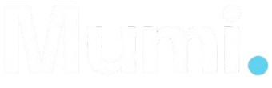

<div align="center">

# Mumi.

**Premium Web Development for Businesses**

[](https://cloudinite.github.io/mumi)
[](https://github.com/Cloudinite)
[](https://x.com/mumi_dev)

<br/>



<br/><br/>

*I help small and large businesses establish a web presence — or completely revamp their outdated, poorly performing websites.*

</div>

---

## What I Do

I build **fast, modern, and beautiful websites** that convert visitors into customers. Whether you're a barbershop, restaurant, hotel, e-commerce store, fitness studio, or creative agency — I deliver premium results.

**Services:**
- Custom website design & development
- Full website redesign & revamp
- E-commerce solutions
- SEO optimization & performance tuning
- Mobile-first responsive design
- Multi-language support

---

## Tech Stack

```
Frontend       →  HTML · CSS · JavaScript · TypeScript · React · Next.js · Vue.js
Styling        →  Tailwind CSS · SASS · Framer Motion
Backend        →  Node.js · PHP · Python · WordPress
Tools          →  Git · Figma · MongoDB
```

---

## Portfolio Previews

This site features **6 interactive demo websites** built from scratch, showcasing what I deliver:

| Project | Type | Theme |
|---------|------|-------|
| **LuxeCart** | E-Commerce | Light, clean, product-focused |
| **The Gentry** | Barbershop | Dark, warm gold, elegant |
| **Elysium** | Hotel & Spa | Warm light, luxury feel |
| **Noir** | Fine Dining | Dark, gold accent, sophisticated |
| **APEX** | Fitness Gym | Dark, cyan energy, bold |
| **Prism** | Digital Agency | Light, purple accent, modern |

Each demo includes real photos, working navigation, interactive elements, forms, and multiple sections.

---

## Features

- **Multi-language** — English, Slovak, Russian, German with smooth transitions
- **Glassmorphism navbar** — Clean, modern navigation
- **Framer Motion animations** — Staggered reveals, scroll effects, hover interactions
- **Contact form** — Direct email delivery via Web3Forms
- **Dark theme** — Deep charcoal with electric cyan accents
- **Fully responsive** — Flawless on mobile, tablet, and desktop
- **Lightning fast** — Static site, no server required

---

## Contact

Have a project in mind? Let's work together.

**Email:** mumidev.business@gmail.com

---

<div align="center">
<sub>Designed & built by <strong>Mumi</strong></sub>
</div>
